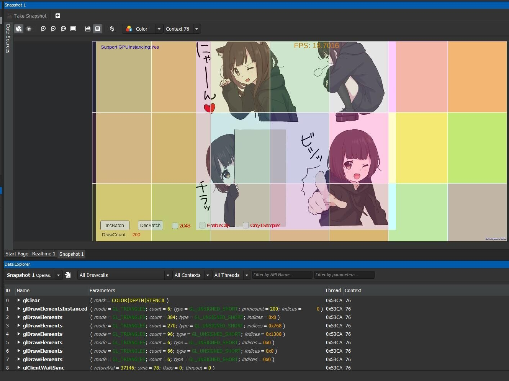

# DrawPerformanceTest
通过使用 GPUInstancing 绘制大量四边形来测试纹理采样和填充性能

## 效果图

#### adreno 630 的 bin layout

## 部分型号帧率测试结果(反复绘制400次)
### 高通845(1480 * 720)
* 4张1024各采样1次
    * 不透明: `22-23`
    * Clip: `21`
    * 半透明: `25`
* 1张1024采样1次
    * 不透明: `52-53`
    * Clip: `55-56`
    * 半透明: `55`

### 猎户座8890(1280 * 720)
* 4张1024各采样1次
    * 不透明: `60`
    * Clip: `14`
    * 半透明: `14`
* 1张1024采样1次
    * 不透明: `60`
    * Clip: `49`
    * 半透明: `56`

### 华为P9 plus（1920 * 1080）
* 4张1024各采样1次
    * 不透明: `23`
    * Clip: `2.6`
    * 半透明: `2.1`
* 1张1024采样1次
    * 不透明: `17.2`
    * Clip: `7`
    * 半透明: `8.4`

### `现象及分析`
* 总体不透明物体渲染效率比 clip 和 blend 高，但高通GPU反而出现了不透明物体不如半透明性能高的现象，更改渲染前后顺序依然如此。
* 半透明渲染华为GPU性能很差，原因可能是华为的 on chip memory 比较小，导致需要依次渲染更多的 Tile
* 增加每个片段着色器内的采样数量时，8890 和华为都表现出了 clip 性能比 blend 高的现象，但高通正好相反，原因不明。
* `本质原因：高通GPU在进行裁剪时每个Tile中的三角形列表中的三角形必须是整个三角形完整位于Tile中才会记录，因此如果某个三角形很大并且跨越Tile则不会执行 early-z`

----------

## 关于 Shader 中使用 if 的性能损失测试(以下数据为平均帧率)

### 8890 第一次启动(每次启动生成的模型位置有些不同)
- SampleAll: 33.85 33.56 34.26
- if: 34.31 34.13 34.46

### 8890 第二次启动
- SampleAll: 33 33.16
- if: 33.06 33.58

### 小米Note 第一次启动
- SampleAll: 31.08 32.166 
- if: 37.58 39.73

### 不采样改为执行 dot
### 小米Note
- SampleAll: 44.51 44.86
- if: 40.66 41.91

## 结论
 1. if 确实会消耗计算量，但是是否要使用还是看具体情况。
 2. 如果要在 if 内做不太多的计算建议还是不要用if，但是如果要在 if 内采样，那大概率使用 if 性能更高。